# INTRODUCTION

The use of AWS Cloud systems is becoming increasingly common. Small and large-scale companies, recognizing this trend, are transitioning to AWS systems.

AWS systems offer significant advantages, especially for startups. They help startups avoid large investment costs and enable them to bring their projects to life quickly. Additionally, if you promote your project, Amazon can provide credits of up to 2000 USD.

I quickly developed a face detection application using AWS systems, utilizing the Rekognition service. I was able to realize my envisioned project quickly without the need to train any models.

Below are the project introduction and information on how it works. I have also prepared an installation section for those who want to try it out. You can easily integrate it into your AWS account using Terraform and test it.


---


# SMILE APP

<div align="center">
  
</div>

## Let your smile be your password.

Kanıt VURAL  
- [linkedin](https://www.linkedin.com/in/kanitvural/)
- [E-mail](mailto:kanitvural@gmail.com)


### Why SMILE app:

- Companies today often use card systems for employee entries.
- These systems can be costly due to card expenses and related device installations.
- Employees may forget their cards at home.
- In companies with many employees, individuals may use each other's cards.
- It can also be used for internal system logins.

To prevent all these problems, I aimed to provide a cost-effective solution using AWS systems.

### What does SMILE app do:

- Employees' faces are recorded in the system. When they look at the camera and smile, they enter the company without needing anything else.
- The names of entering employees are emailed to a group of managers.
- Entry information is analyzed with hourly, daily, weekly, and yearly graphs.

### Purpose:

- The SMILE app aims to reduce costs and prevent the mentioned problems by working on-demand using AWS systems without the need for any cards.

This presentation will simulate an entry into an internal company system.

### TECHNOLOGIES USED

<div align="center">
  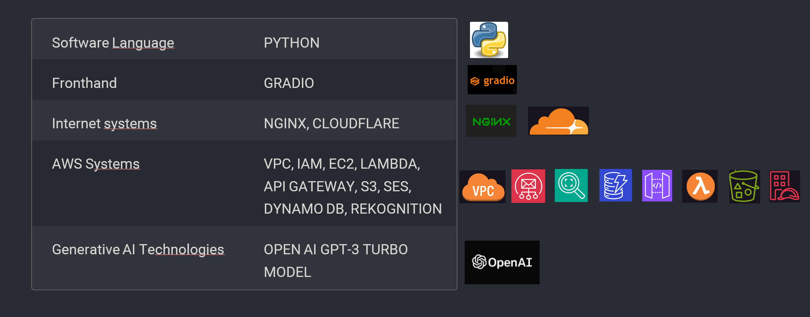
</div>


### HOW SMILE APP WORKS

- The system runs within the lowest-cost EC2 instance inside a VPC.
- When the system is run, DynamoDB and SES services are automatically created by sending a request to the API Gateway.
- The SES service sends a verification message to the admin group. Admin group email addresses are recorded.
- Since the EC2 acts as an intermediary that receives and sends requests, this setup eliminates the need for a costly machine.
- On the web interface broadcasted from EC2, a single photo of new employees is saved to S3.
- When the camera is turned on, the images are again saved in another folder in S3.
- After the saving process, a request is sent to the AWS API Gateway.
- When the request is sent, Lambda is triggered, and the AWS Rekognition face detection model analyzes the face in the saved photo and detects a smile.
- If there is no smile, instead of returning a simple error message, a fine-tuned GPT model makes a joke.
- If a smile is detected, another request is sent to the AWS API Gateway.
- Then another Lambda is triggered, and the AWS Rekognition face comparison model compares the photo with the photos in the archive.
- If it matches a photo in the archive, the user enters the company.
- Then, a request is sent again to the API Gateway. Lambda is triggered, and the employee's name, surname, entry time, and entry photo are saved to DynamoDB.
- Another triggered Lambda sends an email to the manager group via the SES service.
- Users who enter can also be tracked, and analyses can be viewed through the system.

In this setup, the only continuously running service is the lowest-cost EC2. All other services work on-demand when a request is made, creating a cost-effective structure.


### System Architecture Diagram

<div align="center">
  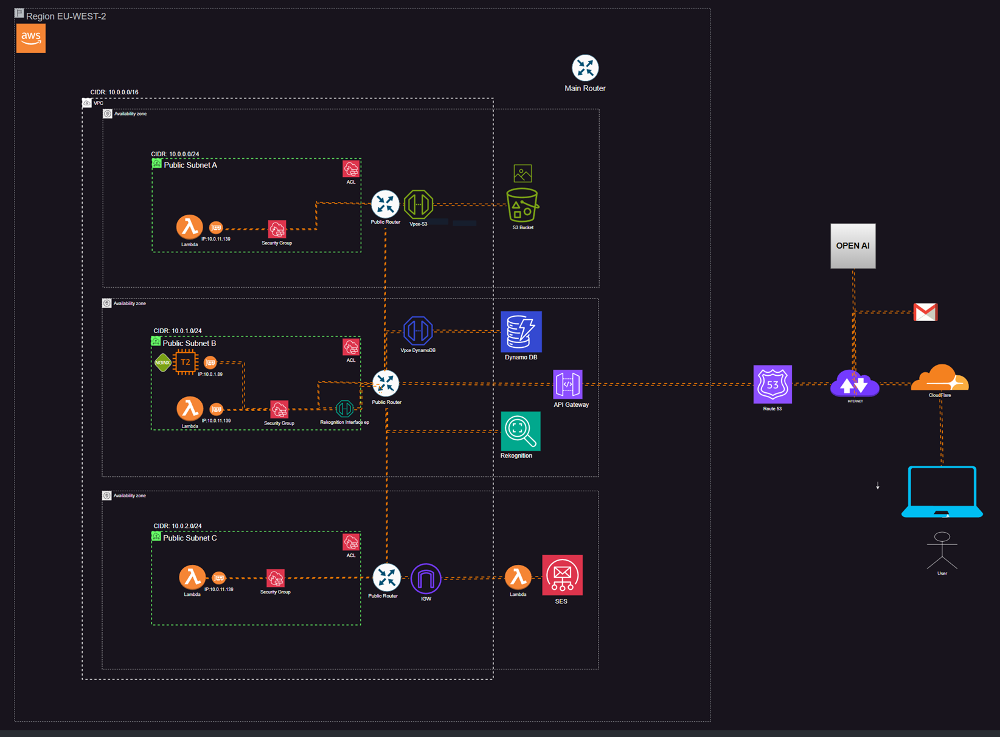
</div>


### INSTALLATION GUIDE

Open an AWS account:
https://aws.amazon.com/free/


Download Terraform:
https://www.hashicorp.com/

**Create Keypair for ec2:**

- only change your username (Windows users can use git bash)
  
`ssh-keygen -t rsa -b 2048 -f C:/Users/YOUR_USERNAME/Desktop/smile2.pem`

**Download repo:**

`git clone https://github.com/kntvrl/aws_smile_project_tf.git`

**You can use vscode editor or whatever you want:**

```
cd aws_smile_project_tf
terraform init
terraform plan 
terraform apply
Enter a value: yes
```
**Copy terraform outputs:**

<div align="left">
  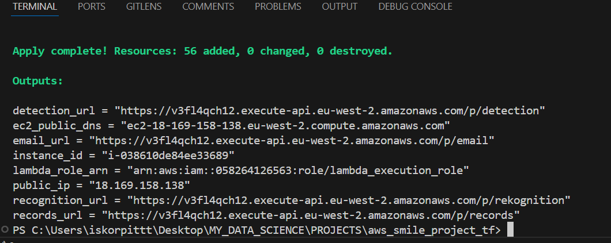
</div>

---

**Go to aws console and chose your region as london and change your mail address:**

<div align="left">
  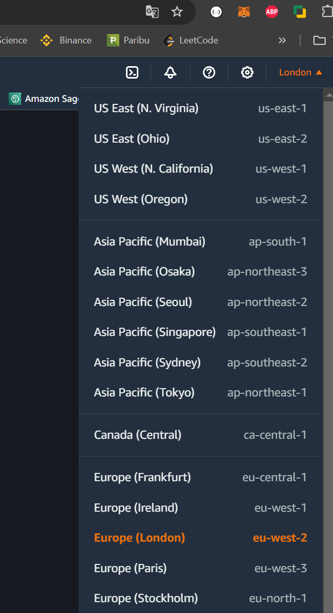
</div>

```
go to lambda > functions > lambda_email
in the code block area, type your email here and click deploy
```

<div align="left">
  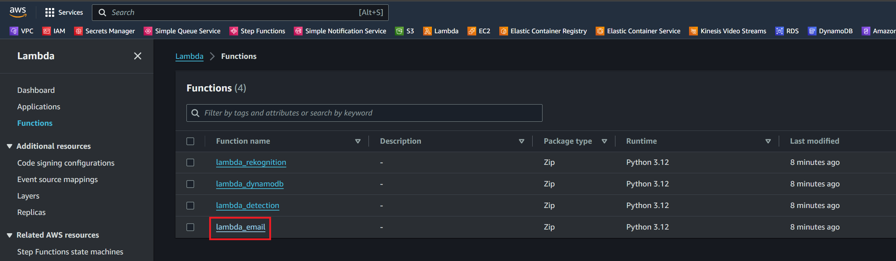
</div>

---

<div align="left">
  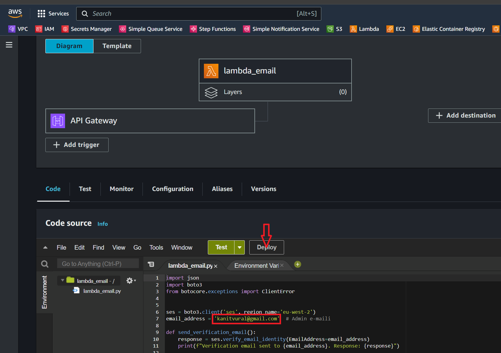
</div>

---

**Open your terminal and connect to ec2 instance:**
```
cd ~/desktop
ssh -i smile2.pem ec2-user@18.169.158.138 # public_ip that you copy from terraform output
command yes

ls # you need to see project file "aws_smile_project_tf" if not wait a little and type ls again

cd aws_smile_project_tf

```

---

**copy the env variables from terraform output here (ctrl x > y > enter):**

`sudo nano .env`

<div align="left">
  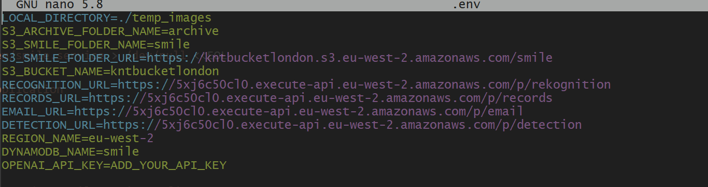
</div>

---

**start the application:**

`sudo systemctl start smile`

---

**Go to your mail and verify your email adress**

---

**you can access the application with ec2_public_dns above:**
```
example:
ec2-18-171-252-102.eu-west-2.compute.amazonaws.com
```
---
**SSL certification:**

I used nginx server in this project, so if you want to open camera you need ssl certification, http sites don't allow to open web cam.

I used cloudflare for ssl certification 

---

**Get the ec2 ip and add the cloudflare dns :**

You need to have domain name for this application.

```
example:
18.171.252.102
```
<div align="left">
  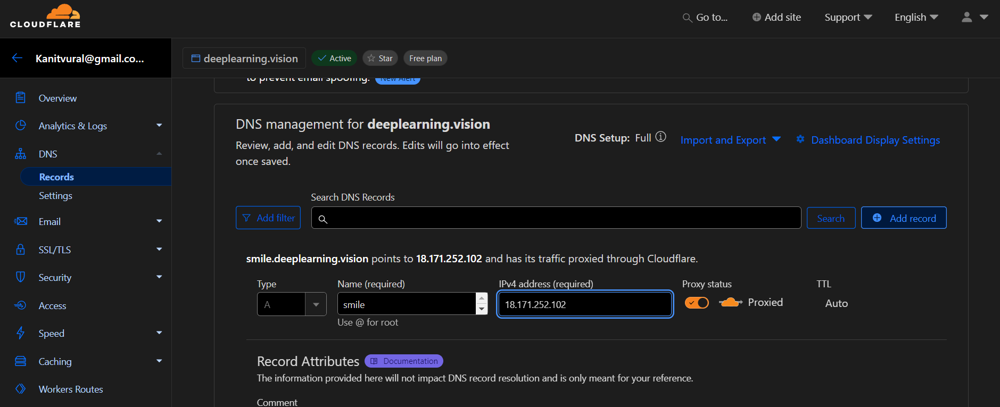
</div>

---

**Welcome to smile app**

When you open the application, firstly record one picture of you and type your Firstname and Lastname and click add person to the system button.

<div align="left">
  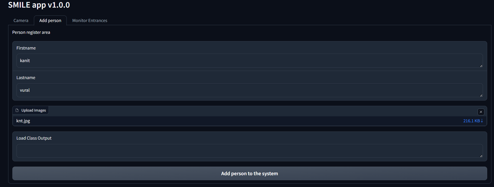
</div>

---

After that open your camera and smile :)

<div align="left">
  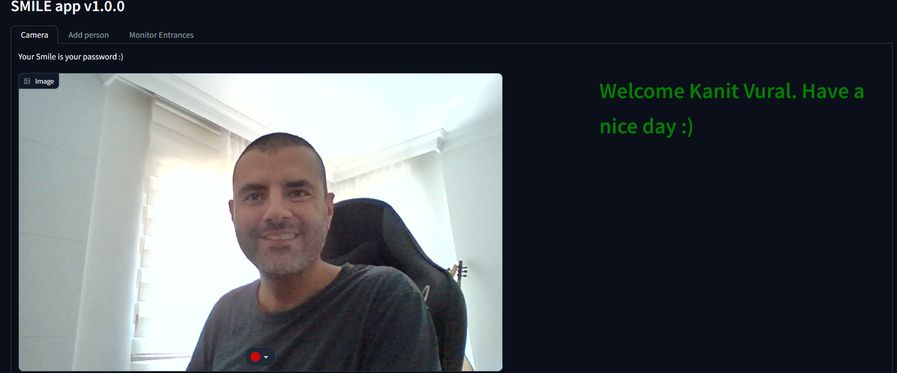
</div>

---

You can also monitor the entrances

<div align="left">
  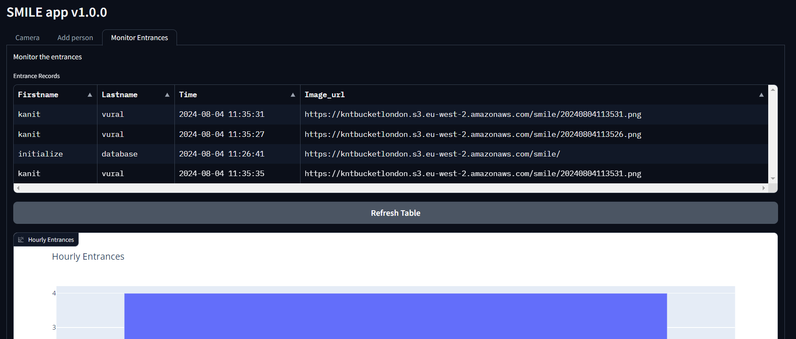
</div>

---

And check your mailbox

<div align="left">
  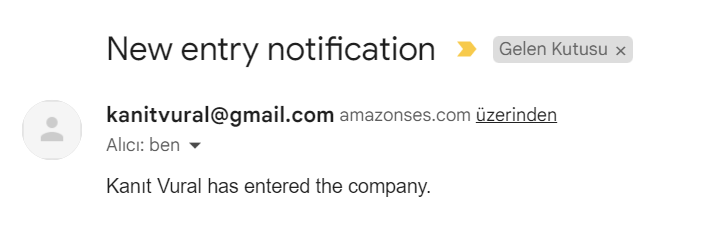
</div>


---

**How to delete the Smile app**

Go back your editor and type

`terraform destroy`

I created Lambda functions to build DynamoDB and SES services automatically, so we need to delete these services manually.

Go to dynamodb service > Tables > select the db and delete.

<div align="left">
  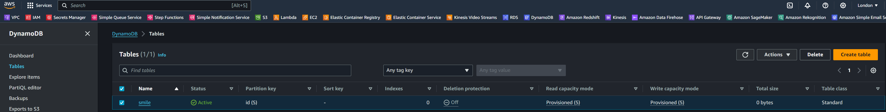
</div>

---

Go to ses service > identities > select your mail and delete. That's all.

<div align="left">
  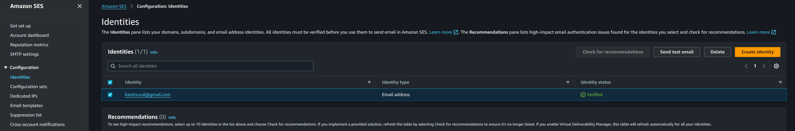
</div>

---

# OPTIONAL

If you have a open ai api key, go to utils.py in ec2 instance and commend out the codes below. An add your api key to .env file in ec2 and restart the service.

`sudo nano utils.py`

After doing this, if ChatGPT doesn’t see you smiling at the camera, it will start telling you jokes!

<div align="left">
  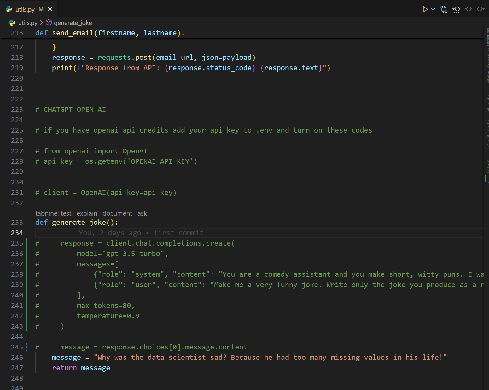
</div>

<div align="left">
  
</div>

`sudo systemctl restart smile`


# CONCLUSION

I tried to explain how to easily create a face recognition application using AWS systems. Feel free to contact me with any questions. Wishing everyone days full of laughter!

Kanıt VURAL  
- [linkedin](https://www.linkedin.com/in/kanitvural/)
- [E-mail](mailto:kanitvural@gmail.com)


